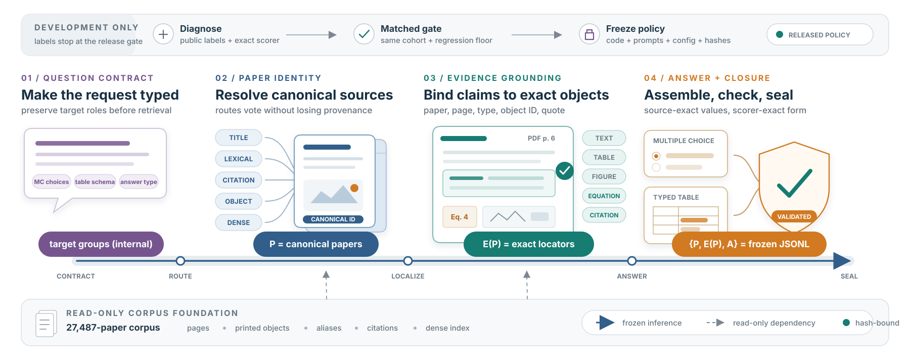

# TRACE

**Target-Aware Retrieval, Attributed Evidence, and Contract-Constrained
Extraction for LitTraceQA**

[Project page](https://sachinkg12.github.io/trace/) ·
[Reproduction guide](docs/reproduction.md) ·
[Results](docs/results.md) ·
[Limitations](docs/limitations.md) ·
[MIT license](LICENSE)

TRACE is team **gabby**'s system for the GroundLM 2026 LitTraceQA shared task.
It treats scientific question answering as a connected identity problem:

```text
question contract -> paper set P -> attributed evidence E(P) -> typed answer A
```

The pipeline preserves question targets through retrieval, grounds evidence to
exact source objects, constructs tables against the organizer schema, and
validates the complete submission contract before writing an output file.



## Official result

The selected clean-track submission scored **0.760613** composite on the
71-question official test set.

| Component | Score |
|---|---:|
| Paper F1 | 0.9728 |
| Evidence F1 | 0.6847 |
| Multiple-choice accuracy | 0.9800 |
| Table row F1 | 0.5423 |
| Table cell accuracy (macro) | 0.3508 |

The complete vector is machine-readable in
[`results/official-test-0.760613.json`](results/official-test-0.760613.json).
The paper discusses the gap to a historical adaptive artifact only as a lesson
about scorer-visible identity; it is not presented as the reproducible system.

## What is in this release

This repository contains the generic full-generation architecture, a pinned
configuration, the official validator, data-fetch and corpus-build utilities,
tests, and documentation. It contains **no benchmark inputs, paper PDFs,
generated predictions, credentials, private paths, query allowlists, or
per-question answer constants**.

The tagged public release is **v1.0.1@6dd7671**. The current `main` branch
adds documentation only; the audited architecture snapshot is **aa4aecf**, and
v1.0.1 adds the packaged evaluator runtime contract. These identities make the
published scope reviewable; they do not turn the separately uploaded test
prediction file into a public asset.

The release deliberately exposes no previous-output or replay interface. A run
starts from the released questions, metadata pool, source PDFs, and indexes.

## Architecture

1. **Contract planning** extracts target papers, requested properties,
   cardinality, modalities, and the exact answer schema.
2. **Target-aware retrieval** combines title/alias, sparse passage, relation,
   source-object, and dense routes without losing target-group identity.
3. **Paper selection** covers answer targets before spending remaining capacity
   on answer-bearing evidence.
4. **Attributed localization** emits scorer-compatible text, table, figure,
   equation, and citation locators tied to selected papers.
5. **Contract-constrained answering** produces multiple-choice labels or typed
   table rows under the supplied schema.
6. **Fail-closed validation** checks paper-evidence closure, output shape,
   provenance hashes, and the pinned organizer validator.

## Installation

Python 3.11–3.13 is supported; the preserved environment used Python 3.12.1.

```bash
python3.12 -m venv .venv
source .venv/bin/activate
python -m pip install --upgrade pip
python -m pip install -e '.[test]'
cp .env.example .env
```

Set `GEMINI_API_KEY` in the shell or local `.env`. Never commit `.env`.

## Data and indexes

```bash
python scripts/fetch_data.py
python -m littraceqa.corpus.download data/paper_metadata.jsonl data/pdfs
python -m littraceqa.corpus.parse \
  data/paper_metadata.jsonl data/pdfs --parsed-dir data/parsed
python -m littraceqa.corpus.build_indexes \
  data/parsed data/indexes --pool data/paper_metadata.jsonl
```

The first dense run creates `data/cache/pool_emb.npy` with
[`BAAI/bge-small-en-v1.5`](https://huggingface.co/BAAI/bge-small-en-v1.5).
Some OpenReview PDFs may require a locally supplied `OPENREVIEW_TOKEN`. See
[`docs/data-and-assets.md`](docs/data-and-assets.md).

## Full-generation command

```bash
export GEMINI_API_KEY='<your-key>'
export LITTRACEQA_SOURCE_REVISION="$(git rev-parse HEAD)"
python -m littraceqa.experiments.submit \
  --config configs/trace-littraceqa.yaml \
  --index-dir data/indexes \
  --inputs data/test.jsonl \
  --pool-path data/paper_metadata.jsonl \
  --pool-emb-cache data/cache/pool_emb.npy \
  --output outputs/predictions.jsonl \
  --trace-output outputs/traces.jsonl \
  --workers 8
```

The command performs full generation only. It verifies the release profile,
validates all 71 output rows, and writes a trace plus a hash-bound provenance
manifest. It reproduces the public base architecture, **not** the exact
composed 0.760613 JSONL: that submission artifact is intentionally not
distributed, and hosted inference can drift.

## Models

TRACE has no task-specific trained checkpoint.

- Planning, text grounding, and answer generation (Flash):
  [`gemini-2.5-flash`](https://ai.google.dev/gemini-api/docs/models).
- Visual table and figure reading (Pro):
  [`gemini-2.5-pro`](https://ai.google.dev/gemini-api/docs/models).
- Dense metadata embeddings:
  [`BAAI/bge-small-en-v1.5`](https://huggingface.co/BAAI/bge-small-en-v1.5).

Hosted model behavior can change even under a fixed identifier. Temperature
zero, fixed seeds, pinned code, source hashes, and manifests make differences
auditable but cannot guarantee identical remote inference bytes.

## Verification

```bash
pytest -q
python -m compileall -q src
python -m littraceqa.experiments.submit --help
python scripts/audit_release.py
python -m pip wheel . --no-deps --no-build-isolation
```

The release audit and its exact checks are documented in
[`docs/release-audit.md`](docs/release-audit.md).

## License and citation

TRACE source is MIT licensed. The vendored organizer validator and LitTraceQA
benchmark files are CC BY-NC 4.0. Source PDFs remain under their publishers'
terms and are downloaded from original URLs rather than redistributed.

Please cite the GroundLM 2026 system paper; metadata is provided in
[`CITATION.cff`](CITATION.cff).
